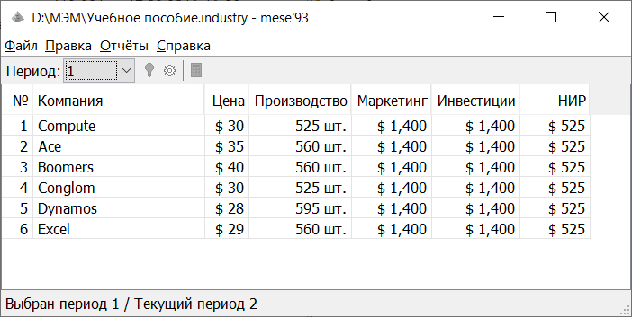
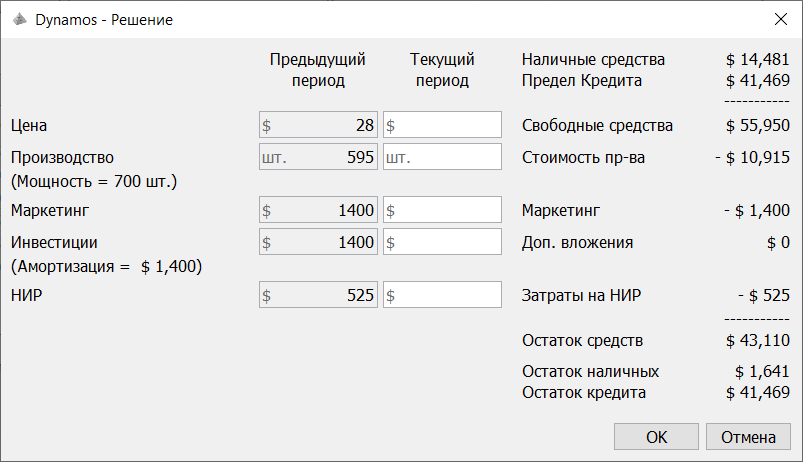
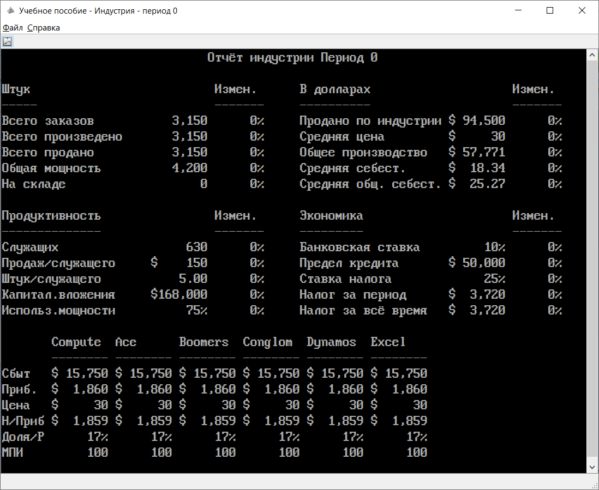

MESE - Management & Economics Simulation Exercise (МЭМ - Моделирование Экономики и Менеджмента)

Программа mese93 - реплика оригинального экономического симулятора Junior Achievement. 
Модель полностью соответствует модели оригинального симулятора.

Для запуска требуется [java]( https://www.java.com) версии 8 и выше.

[Скачать zip архив](mese93.zip)

[Скачать Учебное пособие](Student_Workbook.pdf)

[Отчёт в формате pdf](report.pdf)